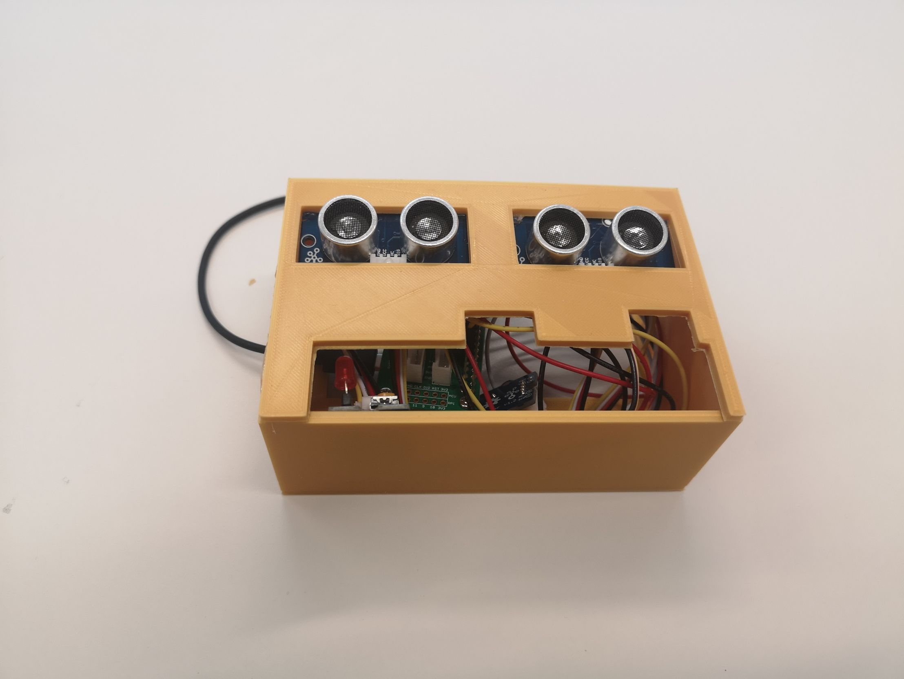

# IoT Engineering
## Project Access Barrier
* code is based on: 
   - https://github.com/Seeed-Studio/grove.py
   - https://community.thingspeak.com/tutorials/update-a-thingspeak-channel-using-mqtt-on-a-raspberry-pi/

## Installation
1. `sudo apt install fish`
1. `chsch`
1. `sudo apt install python3-paho-mqtt python3-flask python3-pip python-pip python3-grove-py`
1. `curl -sL https://github.com/Seeed-Studio/grove.py/raw/master/install.sh | sudo bash -s -`
1. connect headers (pins) as specified
1. move service files `sudo cp run*.service /lib/systemd/system/`

## Configuration for Pi 1

The Raspi1 is connected to 2 GroveUltrasonicRanger, a buzzer and a led.

1. Connect the GroveUltrasonicRanger to D5 & D16
1. Connect the buzzer to digital port 6
1. Connect led to digital port 17

You can change this default values underneath in run1.py
trigger_distance = 120 (trigger distance in centimeters)
time_a = datetime.time(22, 0)
time_b = datetime.time(5, 00)
delay = 0.1

Code for Raspi1 under 
Raspi1 service file: 

## Configuration for Pi 2

The Raspi2 is connected to a buzzer and a led.

1. Connect the button to D5
1. Connect the buzzer to digital port 6
1. Connect led to D16

Code for Raspi2 under 
Raspi2 service file: 

## Run Pi 1
1. ssh pi@raspi1
1. run `sudo systemctl enable run1.service && sudo systemctl start run1.service`

## Run Pi 2 
1. ssh pi@raspi2
1. run `sudo systemctl enable run2.service && sudo systemctl start run2.service`

## ThingSpeak
- https://thingspeak.com/channels/931380

